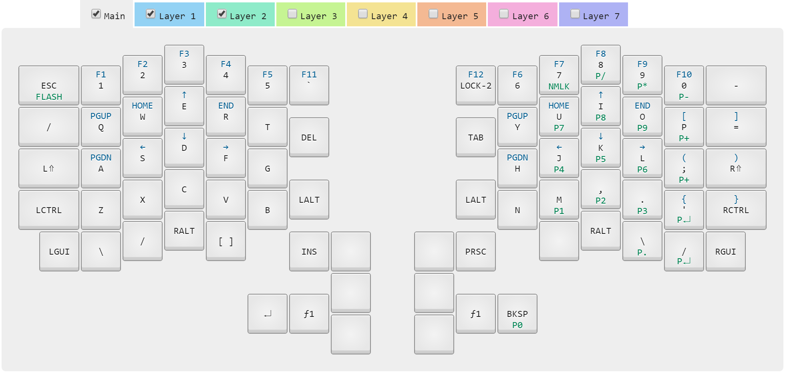

# Infinity ErgoDox layout and Kiibohd kll compiler

Forked and customized from [fredZen;s project](https://github.com/fredZen/ergodox-infinity-layout).
The docker container generated from here is using my fork of the git repo as source for the FW.

MDErgo1-DefaultMy layout for the [Infinity ErgoDox](http://input.club/devices/infinity-ergodox) keyboard.

## Editing

The layout files are in kiibohd/*.kll.

- MDErgo1-Default-0.kll is the main layer
- MDErgo1-Default-1.kll is the layer with arrows, function keys and braces
- MDErgo1-Default-2.kll is the layer with the keypad

## Workflow

My workflow uses the [dockerized version](https://hub.docker.com/r/fmerizen/ergodox-infinity-layout/) of the KLL compiler. First make sure that you have a working docker installation.

1. Edit MDErgo1-Default-*.kll to my liking.
2. If I added or removed a layer, I need to change the value of PartialMaps in kiibohd/ergodox_custom.bash accordingly
3. Run `./compile.sh ergodox_custom.bash` from a docker aware bash. For me that will just be git-bash. And yes, that's correct, there is no directory before ergodox_custom.bash although ergodox_custom.bash is in the kiibohd subdirectory.
4. The compiled firmware is now available as kiibohd/*.dfu.bin.
5. Flash the keyboard with [dfu-util](https://github.com/kiibohd/controller/wiki/Loading-DFU-Firmware). It's enough to flash the master half of the keyboard (the one that's plugged into the keyboard). For instance, I always have the right half plugged into the computer; the left half is plugged into the right half. So I flash right_kiibohd.dfu.bin.
